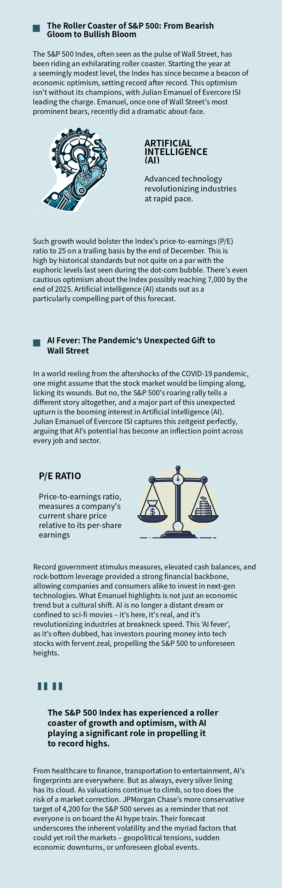

# An AI agent for making infographics

## Design goal:
Given the short attention span of everyone, long-form content, when it's pure text, is very unattractive for people to consume. This is why incorporating visual elements such as infographics, images, and videos into content has become essential. These elements break down complex information into bite-sized, easily digestible pieces, making the content more engaging and accessible. 

## Example

  

